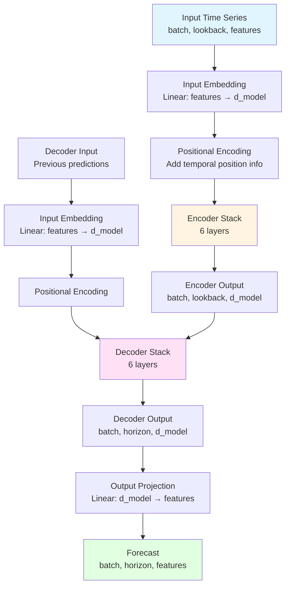

# Temporal: Transformer-Based Time Series Forecasting

A PyTorch implementation of a transformer-based model for time series forecasting, inspired by modern attention-based approaches.

## Overview

Temporal is a foundational model for time series forecasting based on the revolutionary self-attention mechanism introduced in "Attention is All You Need". Unlike language models, Temporal is specifically designed and trained to minimize forecasting error on time series data.

### Key Features

- **Self-Attention Mechanism**: Captures complex temporal dependencies and patterns
- **Encoder-Decoder Architecture**: Multi-layer transformer with residual connections and layer normalization
- **Flexible**: Supports both univariate and multivariate time series
- **Scalable**: Can handle various sequence lengths and forecasting horizons
- **Autoregressive Generation**: Inference mode for multi-step ahead forecasting

## Architecture

The Temporal model consists of:

1. **Input Embedding**: Projects time series data to model dimension
2. **Positional Encoding**: Captures temporal order (sinusoidal or learnable)
3. **Encoder Stack**: Multiple layers of self-attention and feed-forward networks
4. **Decoder Stack**: Multiple layers with self-attention, cross-attention, and feed-forward networks
5. **Output Projection**: Maps decoder output to forecasting window dimension

### Architecture Diagram



Each layer includes:
- Multi-head self-attention
- Residual connections
- Layer normalization
- Feed-forward networks with GELU activation

**For more diagrams**, see [DIAGRAMS.md](DIAGRAMS.md) - complete visual documentation with:
- Encoder/Decoder architecture
- Multi-head attention mechanism
- Training and inference flows
- Data pipeline
- Component interactions

## Installation

### From PyPI

```bash
pip install temporal-forecasting
```

### From Source

```bash
git clone https://github.com/OptimalMatch/temporal.git
cd temporal
pip install -r requirements.txt
pip install -e .
```

### Requirements

- Python >= 3.8
- PyTorch >= 2.0.0
- NumPy >= 1.20.0
- tqdm >= 4.60.0
- matplotlib >= 3.3.0

## Quick Start

### Basic Usage

```python
import torch
from temporal import Temporal

# Create model
model = Temporal(
    input_dim=1,           # Univariate time series
    d_model=256,           # Model dimension
    num_encoder_layers=4,  # Number of encoder layers
    num_decoder_layers=4,  # Number of decoder layers
    num_heads=8,           # Attention heads
    d_ff=1024,            # Feed-forward dimension
    forecast_horizon=24,   # Predict 24 steps ahead
    dropout=0.1
)

# Input: (batch_size, sequence_length, input_dim)
x = torch.randn(32, 96, 1)

# Generate forecast
forecast = model.forecast(x)  # (32, 24, 1)
```

### Training Example

```python
from temporal import Temporal
from temporal.trainer import TimeSeriesDataset, TemporalTrainer
from torch.utils.data import DataLoader
import torch

# Prepare your data
train_data = ...  # Shape: (num_samples, num_features)

# Create dataset
dataset = TimeSeriesDataset(
    train_data,
    lookback=96,
    forecast_horizon=24,
    stride=1
)

# Create data loader
train_loader = DataLoader(dataset, batch_size=32, shuffle=True)

# Create model
model = Temporal(
    input_dim=train_data.shape[1],
    d_model=256,
    num_encoder_layers=4,
    num_decoder_layers=4,
    num_heads=8,
    d_ff=1024,
    forecast_horizon=24
)

# Create optimizer
optimizer = torch.optim.AdamW(model.parameters(), lr=1e-4)

# Create trainer
trainer = TemporalTrainer(
    model=model,
    optimizer=optimizer,
    criterion=torch.nn.MSELoss()
)

# Train
history = trainer.fit(
    train_loader=train_loader,
    num_epochs=100,
    early_stopping_patience=10,
    save_path="best_model.pt"  # Automatically saves best model
)
```

### Saving and Loading Models

```python
# Save trained model
torch.save(model.state_dict(), 'temporal_model.pt')

# Load model for inference
model = Temporal(input_dim=1, forecast_horizon=24)
model.load_state_dict(torch.load('temporal_model.pt'))
model.eval()

# Make predictions
forecast = model.forecast(x)
```

For complete guide on model persistence, see [MODEL_PERSISTENCE.md](MODEL_PERSISTENCE.md).

## Examples

### Univariate Time Series

See `examples/basic_usage.py` for a complete example with synthetic data:

```bash
cd examples
python basic_usage.py
```

This will:
- Generate synthetic time series data
- Train a Temporal model
- Generate forecasts
- Visualize results

### Multivariate Time Series

See `examples/multivariate_example.py` for forecasting multiple correlated features:

```bash
cd examples
python multivariate_example.py
```

### Model Persistence

See `examples/model_persistence_example.py` for saving and loading trained models:

```bash
cd examples
python model_persistence_example.py
```

This demonstrates:
- Training and saving a model with all components
- Loading saved models for inference
- Production-ready model deployment

## Model Configuration

### Parameters

| Parameter | Description | Default |
|-----------|-------------|---------|
| `input_dim` | Number of input features | 1 |
| `d_model` | Model dimension | 512 |
| `num_encoder_layers` | Number of encoder layers | 6 |
| `num_decoder_layers` | Number of decoder layers | 6 |
| `num_heads` | Number of attention heads | 8 |
| `d_ff` | Feed-forward dimension | 2048 |
| `forecast_horizon` | Number of steps to forecast | 24 |
| `max_seq_len` | Maximum sequence length | 5000 |
| `dropout` | Dropout probability | 0.1 |
| `use_learnable_pe` | Use learnable positional encoding | False |

### Recommended Configurations

**Small Model** (Fast training, lower accuracy):
```python
model = Temporal(
    d_model=128,
    num_encoder_layers=2,
    num_decoder_layers=2,
    num_heads=4,
    d_ff=512
)
```

**Medium Model** (Balanced):
```python
model = Temporal(
    d_model=256,
    num_encoder_layers=4,
    num_decoder_layers=4,
    num_heads=8,
    d_ff=1024
)
```

**Large Model** (Best accuracy, slower training):
```python
model = Temporal(
    d_model=512,
    num_encoder_layers=6,
    num_decoder_layers=6,
    num_heads=16,
    d_ff=2048
)
```

## Training Tips

1. **Learning Rate**: Start with 1e-4 and use a scheduler (e.g., ReduceLROnPlateau)
2. **Batch Size**: Use the largest batch size that fits in memory (32-128)
3. **Gradient Clipping**: Use gradient clipping (0.5-1.0) to prevent exploding gradients
4. **Early Stopping**: Monitor validation loss and stop when it plateaus
5. **Data Normalization**: Normalize your data (e.g., StandardScaler) before training

## Architecture Details

### Multi-Head Attention

The model uses scaled dot-product attention:

```
Attention(Q, K, V) = softmax(QK^T / √d_k)V
```

Multiple attention heads allow the model to attend to different aspects of the time series simultaneously.

### Positional Encoding

Two types of positional encoding are available:

1. **Sinusoidal** (default): Fixed sinusoidal functions
2. **Learnable**: Learned embeddings for each position

### Autoregressive Generation

During inference, the model generates forecasts autoregressively:
- Start with the last observed value
- Generate next step prediction
- Use prediction as input for next step
- Repeat for entire forecast horizon

## Modern Time Series Transformers

Temporal implements a transformer architecture similar to modern approaches in time series forecasting:

| Feature | Modern Approaches | Temporal |
|---------|---------|----------|
| Architecture | Transformer | Transformer |
| Attention | Multi-head | Multi-head |
| Layers | Encoder-Decoder | Encoder-Decoder |
| Training | Large-scale pre-training | User-provided data |
| Flexibility | Fixed models | Fully customizable |

## Performance

Performance varies by dataset and configuration. Typical metrics on benchmark datasets:

- **MSE**: 0.01-0.1 (normalized data)
- **MAE**: 0.05-0.3 (normalized data)
- **Training Time**: 1-10 minutes per epoch (depending on size)

## API Reference

### Temporal

Main model class for time series forecasting.

**Methods**:
- `forward(src, tgt=None, src_mask=None, tgt_mask=None)`: Forward pass
- `forecast(x, horizon=None)`: Generate forecasts
- `generate_causal_mask(size)`: Create causal attention mask

### TemporalTrainer

Training utilities for Temporal models.

**Methods**:
- `train_epoch(dataloader)`: Train for one epoch
- `validate(dataloader)`: Validate the model
- `fit(train_loader, val_loader, num_epochs, ...)`: Full training loop
- `predict(dataloader)`: Generate predictions

### TimeSeriesDataset

Dataset class for time series data.

**Parameters**:
- `data`: Time series data array
- `lookback`: Number of historical steps
- `forecast_horizon`: Number of future steps
- `stride`: Stride for sliding window

## Contributing

Contributions are welcome! Please feel free to submit a Pull Request.

## License

This project is licensed under the MIT License - see the LICENSE file for details.

## Citation

If you use this code in your research, please cite:

```bibtex
@software{temporal2024,
  title = {Temporal: Transformer-Based Time Series Forecasting},
  year = {2024},
  note = {A PyTorch implementation of transformer architecture for time series},
  url = {https://github.com/OptimalMatch/temporal}
}
```

## References

- Vaswani et al., "Attention is All You Need" (2017)
- Modern transformer-based time series forecasting approaches

## Acknowledgments

This implementation is inspired by modern transformer architectures for time series forecasting and the original Transformer paper.
